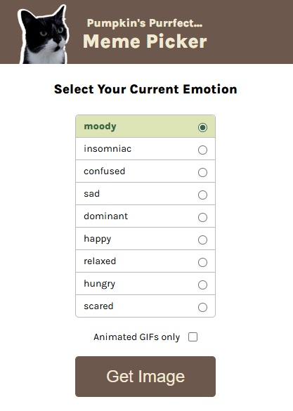

# Pumpkin's Purrfect Meme Picker

A fun web application that lets you select cat memes based on different emotions. Choose your current emotion and get a perfectly matched cat meme or GIF!

[Live Demo](https://delicate-marzipan-18d5fb.netlify.app/)



## About

This project was created as part of The Frontend Developer Career Path at Scrimba. It allows users to find the perfect cat meme that matches their current emotional state.

## Features

- Select from various emotions (happy, sad, hungry, etc.)
- Filter for animated GIFs only
- Random selection from matching cat images
- Modal display of the selected meme
- Close modal by clicking the X button or clicking outside the modal

## Technologies

- HTML
- CSS
- JavaScript (ES6+)
- JavaScript Modules
- Google Fonts (Karla)

## How it works

1. Choose an emotion from the radio button options
2. Optionally check "Animated GIFs only" for moving images
3. Click "Get Image" to generate a random matching cat meme
4. View your personalized cat meme in a modal
5. Close the modal to select another emotion

## Project Structure

```
meme-picker/
├── images/
│   ├── pumpkin.png
│   ├── angry.jpeg
│   ├── angry.gif
│   └── ... (other cat images)
├── index.html
├── index.css
├── index.js
├── data.js
└── README.md
```

## Running the project

Clone the repository and open `index.html` in your browser:

```bash
git clone https://github.com/phattp/meme-picker.git
cd meme-picker
```

## What I learned

- Working with JavaScript modules (import/export)
- Handling radio button selections and checkbox states
- Implementing event delegation
- Creating and controlling modal displays
- Filtering arrays based on multiple criteria
- Generating dynamic HTML content
- Improving user experience with visual feedback (highlighting selected options)

---

Created by [Phatthara Pisootrapee](https://github.com/phattp) | [The Frontend Developer Career Path at Scrimba](https://scrimba.com/learn/frontend)
